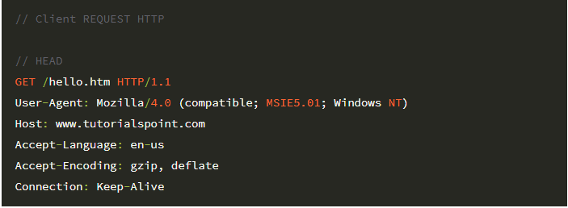

# java-was-2022
Java Web Application Server 2022

## 0. 프로젝트 정보 

이 프로젝트는 우아한 테크코스 박재성님의 허가를 받아 https://github.com/woowacourse/jwp-was 
를 참고하여 작성되었습니다.

## 1. 들어가며

### 1.1. 프로젝트 소개
- HTTP 프로토콜에 대한 이해도를 높인다.
- WAS를 직접 구현함으로써 WAS의 동작 원리에 대해서 학습한다.

### 1.2. 기능
#### 주요 기능 명세
- CRUD 게시판 기능 구현
- HTTP GET, POST 요청 응답
- css, js 등 확장자에 따른 컨텐츠 타입 응답 지원
- 쿠키를 이용한 로그인 기능 구현
- 동적인 HTML 페이지 생성 기능 구현

#### 부가 기능 명세
- 소켓 통신 기반에서 소켓의 연결 상태를 확인해 비정상 종료 탐지 기능 구현
- Spring의 HandlerMapping, dispatch과 비슷하게 동작하는 로직 구현
- 예외를 Mapping된 Handler에게 전달해주는 ExceptionHandler 기능 구현

### 1.3. 사용 기술
Java

## 2. 블로그 학습 정리

- [Socket의 연결종료와 Timeout 설정하기](https://porolog.tistory.com/38)
- [Reflection, Annotation 활용기 1 - @RequestMapping 구현하기](https://porolog.tistory.com/39)
- [Reflection, Annotation 활용기 2 - @ExceptionHandler 구현하기](https://porolog.tistory.com/40)
